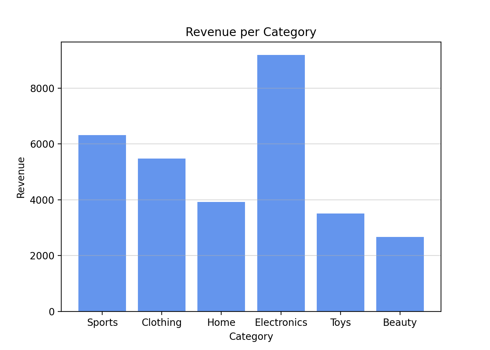
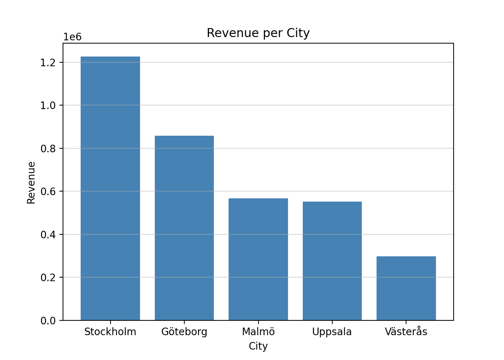

# EDA - E-commerce

## Report
### From the notebook, after cleaning the data
In the first 6 months of 2024:
- **7463 units** were sold.
- **3502767.23 sek** sek in revenue.
- **1401.11 sek** average order value.

### Visualization

### Tabels (exported)
- `data/pivot_city_x_category.csv`

### Conclusions based on current data
- **Top categories**: 1. Electronics (1364228.07 sek), 2. Sports (734653.42 sek), 3. Clothing (586744.91 sek)
- **Top cities**: 1. Stockholm (1227201.94 sek), 2. Göteborg (859019.65 sek), 3. Malmö (567926.32 sek).
- **Top season**: January with **664083.32 sek** in revenue.
- **Notes**: Electronigs has a wide range of price - organize the products by price tier

## Environment 
- **Python:** 3.13.7 
- **Package:** `Pandas`, `matplotlib` (see `requirements.txt`) 

## Get started 
- Clone the project: https://github.com/IreneGrisenti/E-handel.git
- Create and activate virtual environment 
- Install requirements.txt